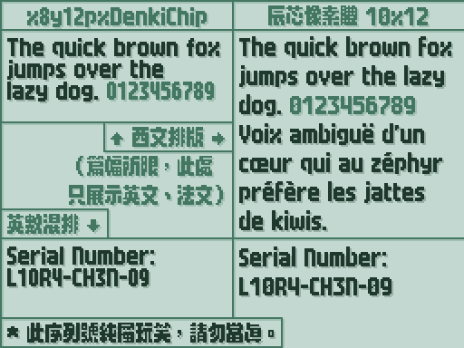

# 辰芯像素體 10x12 | Liora Chip 10x12
- 這是一款又酷又萌的中文像素字體，基於「[x8y12pxDenkiChip](https://github.com/hicchicc/x8y12pxDenkiChip)」增補及修改。
- 本字體目前還在**先行測試階段**，**仍缺少大量漢字**。

## ℹ️ 簡　介
- 2026 年 2 月，日本像素字體作者[患者長ひっく](https://github.com/hicchicc)發佈了全新的日文像素字體「[x8y12pxDenkiChip](https://github.com/hicchicc/x8y12pxDenkiChip)（電氣芯片）」，其採用扎實的粗體設計，兼具炫酷、可愛與科技感。
- 然而，這款字體僅僅收錄了日本小學 4 年級水平內的 640 個漢字，**不論對中文還是日文都不夠用**。
- 於是，本人著手對這款字體進行修改，使其更好地支持簡繁中文，同時優化並擴展了原作的西文部分。
> [!IMPORTANT]
>
> **重要**：本字體使用 [Bits'N'Picas](https://github.com/kreativekorp/bitsnpicas) 製作。因軟件限制，本字體未保留原字體的 OpenType 特性。OpenType 特性將在正式版加入。

## 📜 樣　張

> 原字體的西文字符集僅支持基本拉丁文，本字體對原字體的西文字符集進行了大幅擴展；此外，為更好地顯示帶變音符號的字母，本字體調高了行高，多行排版的視覺效果亦顯著提昇。
> 
> 本字體也將原字體的阿拉伯數字由 6 像素寬調整至 7 像素寬，英數混排更加和諧。

## ©️ 版　權
- 本字體使用「[SIL 開放字體許可證 第 1.1 版](https://openfontlicense.org/)」授權，保留字體名稱「Liora」。

## 😊 感　謝
|序號|人員|備註|
|:---:|:---:|---|
|1|[患者長ひっく](https://github.com/hicchicc)|開源原字體「[x8y12pxDenkiChip](https://github.com/hicchicc/x8y12pxDenkiChip)」|
|2|[Minseo Lee](https://github.com/quiple)|開源「[x10y12pxDenkiChipHangul](https://github.com/quiple/x10y12pxDenkiChipHangul)」為本字體提供諺文部分（將在正式版加入）|
|3|製作本字體所用軟件的開發者們|為本字體的製作提供工具|
|4|為本字體建言獻策的群友們||
|5|使用這款字體的你||
